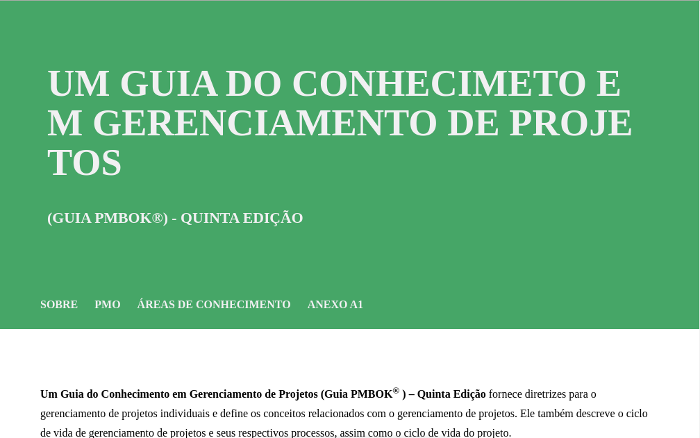
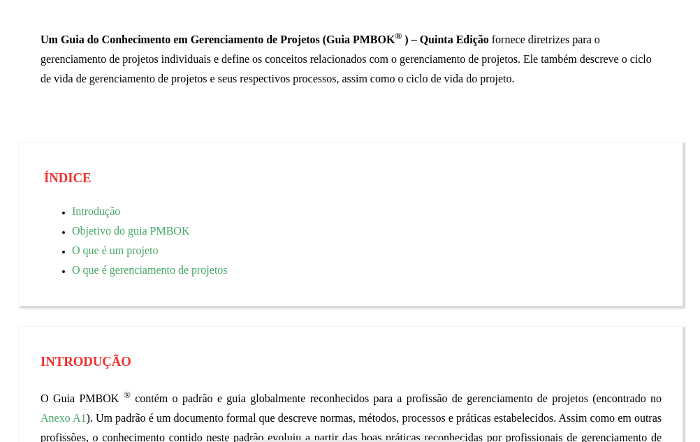

# pagina-pmbok

### 100daysofcode ###

**dia 4 round 1**

Este projeto consiste na construção de uma página completa sobre gerenciamento de projetos. A página possui alguns trechos do livro "Um guia do conhecimento em gerenciamento de projetos - guia PMBOK, quinta edição".

O projeto consiste de quatro páginas, links internos com âncoras. É um projeto que será construido aos poucos o conhecimentos adiquirido em mesu estudos de HTML e CSS.

---

